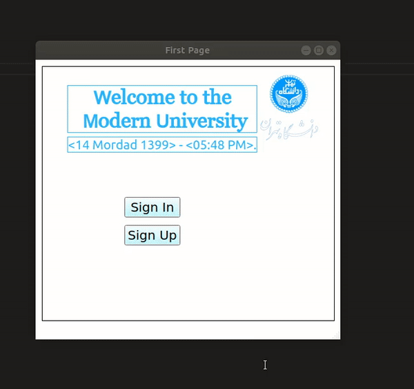

 

  <h3 align="center">  College Management System With Database</h3>
  

    College Management System With Database using PyQt5 and SQLite3.
     
  

## Table of Contents

* [About the Project](#about-the-project)
	* [Users](#users)
		*   :pencil2:[Dean of Faculty](#dean_of_faculty)
		*   :pencil2:[Professor](#professor)
		*   :pencil2:[Student](#student)  
  * [Built With](#built-with)
* [Getting Started](#getting-started)
  * [Prerequisites](#prerequisites)
  * [Usage](#usage)
* [Contact](#contact)

<!-- ABOUT THE PROJECT -->
## About The Project

This College Management System has a beautiful user interface using PyQt5 and connects to the database with SQLite3. Three types of users can sign up and do various things.

### Users
1. #### Dean of Faculty
	- Management
		- Academics
			- Professors
				- All Professors
				- Top Professors
			- Students
 				- All Students
				- Top Students
			- Classes
	- Requests
		- New Student Request
		- New Class Request
	- Profile 
		- Edit Profile
		- Change Password
		- Sign Out
 
2. #### Professor
	- Class Management
		- My Classes
		- Class Request
			- New Class Request
			- Class Requests Status
		- Students
		- Submit Grades
	- Profile 
		- Edit Profile
		- Change Password
		- Sign Out
	
3.  #### Student
	 - Academics
		 - Courses
			 - My Courses
			 - Exam Schedule
			 - Class Enrollment
		- Report Card
		- Instructor Evaluation
	- Profile 
		- Edit Profile
		- Change Password
		- Sign Out
	
Example of student main page:

### Built With

* [PyQt5](https://pypi.org/project/PyQt5/)
* [SQLite3](https://www.sqlite.org/index.html)

<!-- GETTING STARTED -->
## Getting Started

### Prerequisites

* PyQt5
* SQLite3

### Usage

To start the program, run the <Modern_University.py> file.

These users are already registered in <Modern_University.db> and are ready to use: 

| Students  | Username  | Password |
| ------------- | ------------- |------------- |
| 1 | 610398124  | zr  |
| 2 | 610399124  | cm  |
| 3 | 610397124  | kw  |
| 4 | 610396124  | bh  |

---
| Professors  | Username  | Password |
| ------------- | ------------- |------------- |
| 1 |freddie@gmail.com | fm  |
| 2 |rabbani@gmail.com  | rr  |
| 3 |doe@gmail.com   | jd  |
---
| Dean  | Username  | Password |
| ------------- | ------------- |------------- |
| 1 | yasemi@gmail.com  | sy  |
---
To register as a new student after filling the sign up form you have to sign in as the dean of faculty and accept your request then sign in from the first page.

You can create an empty database file with tables by running the <database_setup.py> file from Data folder. Make sure to delete the existing database before creating a new one.    

You can print and see all the information from database by running the <see_data> file. 

All the pages have been designed with QtDesigner and you can find them in <Ui_Classes> folder.
<!-- CONTACT -->
## Contact

Parisa Rabbany - Parisa.Rabbany@gmail.com

